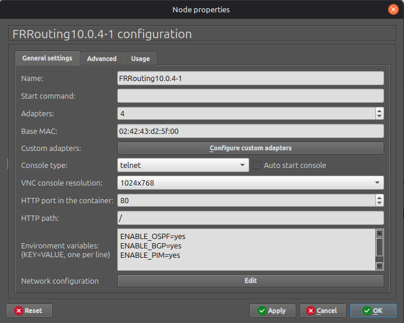

# kiv-psi-frr-docker

This project is a Docker container based on the [FRRouting Project](http://www.zcu.cz)
original [Docker image](https://quay.io/repository/frrouting/frr?tab=tags),
with some minor customizations to make it usable as a [GNS3](https://www.gns3.com/)
router appliance which can be easily [imported](https://docs.gns3.com/docs/using-gns3/beginners/import-gns3-appliance)
and immediately used in the [GNS3 GUI](https://docs.gns3.com/docs/using-gns3/beginners/the-gns3-gui).

The main improvements are:

1. The *[VTY shell](https://docs.frrouting.org/en/latest/vtysh.html)* utility is immediately available, when you open the
[Console terminal](https://docs.gns3.com/docs/using-gns3/beginners/the-console-terminal) of the ```frr-router``` appliance.

2. The [routing protocol daemons](https://docs.frrouting.org/en/latest/protocols.html) are started based on environment variables
passed to the appliance (container). These can be configured using the [GNS node context menu](https://docs.gns3.com/docs/using-gns3/beginners/change-node-symbol) and choosing '''Configure'''. In the follwing dialog box, you can then set the ```ENABLE_*``` variables
to ```yes``` in order to start the given routing protocol daemon:



Here's a list of accepted environment variables and the associated routing daemons:

- ***ENABLE_BGP*** - [BPG](https://docs.frrouting.org/en/latest/bgp.html). BGP stands for Border Gateway Protocol. The latest BGP version is 4. BGP-4 is one of the Exterior Gateway Protocols and the de facto standard interdomain routing protocol. BGP-4 is described in [RFC-1771](https://datatracker.ietf.org/doc/html/rfc1771.html) and updated by [RFC-4271](https://datatracker.ietf.org/doc/html/rfc4271.html). [RFC-2858](https://datatracker.ietf.org/doc/html/rfc2858.html) adds multiprotocol support to BGP-4.
- ***ENABLE_OSPF*** - [OSPF v2](https://docs.frrouting.org/en/latest/ospfd.html). OSPF version 2 is a routing protocol which is described in [RFC-2328](https://datatracker.ietf.org/doc/html/rfc2328.html). OSPF is an IGP. Compared with RIP, OSPF can provide scalable network support and faster convergence times. OSPF is widely used in large networks such as ISP backbone and enterprise networks.
 Multiple instances are not supported by this image, eventough it's supported by the parent image.
- ***ENABLE_OSPF6*** - [OSPF v3](https://docs.frrouting.org/en/latest/ospf6d.html). OSPF version 3 for IPv6 as described in [RFC-2740](https://datatracker.ietf.org/doc/html/rfc2740.html).
- ***ENABLE_RIP*** - [RIP](https://docs.frrouting.org/en/latest/ripd.html). Supports RIP version 2 as described in [RFC-2453](https://datatracker.ietf.org/doc/html/rfc2453) and RIP version 1 as described in [RFC-1058](https://datatracker.ietf.org/doc/html/rfc1058).
- ***ENABLE_RIPNG*** - [RIPng](https://docs.frrouting.org/en/latest/ripngd.html). RIP Next Generation; support for IPv6 as described in [RFC-2080](https://datatracker.ietf.org/doc/html/rfc2080.html).
- ***ENABLE_ISIS*** - [IS-IS / ISO10589](https://docs.frrouting.org/en/latest/isisd.html). ISIS is a routing protocol which is described in [ISO-10589](https://www.iso.org/standard/30932.html), [RFC-1195](https://datatracker.ietf.org/doc/html/rfc1195.html), [RFC-5308](https://datatracker.ietf.org/doc/html/rfc5308.html). ISIS is an IGP. Compared with RIP, ISIS can provide scalable network support and faster convergence times like OSPF. ISIS is widely used in large networks such as ISP and carrier backbone networks.
- ***ENABLE_PIM*** - [PIM](https://docs.frrouting.org/en/latest/pim.html). Protocol Independent Multicast for IPv4, supports PIM-SM (sparse mode) ([RFC-7761](https://datatracker.ietf.org/doc/html/rfc7761)), IGMP v2 ([RFC-2236](https://datatracker.ietf.org/doc/html/rfc2236))and v3 ([RFC-9776](https://datatracker.ietf.org/doc/html/rfc9776)).
- ***ENABLE_PIM6*** - [PIM6](https://docs.frrouting.org/en/latest/pimv6.html). Protocol Independent Multicast for IPv6, supports PIM-SM (sparse mode)  ([RFC-7761](https://datatracker.ietf.org/doc/html/rfc7761)) as well as MLD (Multicast Listener Discovery) v1 and v2.
- ***ENABLE_LDP*** - [LDP](https://docs.frrouting.org/en/latest/ldpd.html) - a standardised protocol that permits exchanging MPLS label information between MPLS devices.
- ***ENABLE_NHRP*** - [NHRP](https://docs.frrouting.org/en/latest/nhrpd.html). NBMA Next Hop Resolution Protocol - [RFC-2332](https://datatracker.ietf.org/doc/html/rfc2332).
- ***ENABLE_EIGRP*** - [EIGRP](https://docs.frrouting.org/en/latest/eigrpd.html). Cisco's Enhanced Interior Gateway Routing Protocol - [RFC-7868](https://datatracker.ietf.org/doc/html/rfc7868).
- ***ENABLE_BABEL*** - [Babel](https://docs.frrouting.org/en/latest/babeld.html). The Babel Routing Protocol - [RFC-6126](https://datatracker.ietf.org/doc/html/rfc6126.html)
- ***ENABLE_SHARP*** - [SHARP](https://docs.frrouting.org/en/latest/sharp.html). SHARP is a daemon that provides miscellaneous functionality used for testing FRR and creating proof-of-concept labs.
- ***ENABLE_PBR*** - [PBR](https://docs.frrouting.org/en/latest/pbr.html).PBR is Policy Based Routing, which means forwarding based on packet fields other than solely the destination IP address.
- ***ENABLE_BFD*** - [BFD](https://docs.frrouting.org/en/latest/bfd.html) - a protocol intended to detect faults in the bidirectional path between two forwarding engines, including interfaces, data link(s), and to the extent possible the forwarding engines themselves, with potentially very low latency - [RFC-5880](https://datatracker.ietf.org/doc/html/rfc5880.html).
- ***ENABLE_FABRIC*** - [Open Fabric](https://docs.frrouting.org/en/latest/fabricd.html). OpenFabric, specified in [draft-white-openfabric-06.txt](https://datatracker.ietf.org/doc/html/draft-white-openfabric-06), is a routing protocol derived from IS-IS, providing link-state routing with efficient flooding for topologies like spine-leaf networks.
- ***ENABLE_VRRP*** - [VRRP](https://docs.frrouting.org/en/latest/vrrp.html) stands for Virtual Router Redundancy Protocol. This protocol is used to allow multiple backup routers on the same segment to take over operation of each others’ IP addresses if the primary router fails. This is typically used to provide fault-tolerant gateways to hosts on the segment. FRR implements VRRPv2 ([RFC 3768](https://datatracker.ietf.org/doc/html/rfc3768.html)) and VRRPv3 ([RFC 5798](https://datatracker.ietf.org/doc/html/rfc5798.html)). 
- ***ENABLE_PATH*** - [PATH](https://docs.frrouting.org/en/latest/pathd.html) - a daemon that handles the installation and deletion of Segment Routing (SR) Policies. Based on MPLS (This means that your OS of choice must support MPLS), SR add a stack of MPLS labels to ingress packets so these packets are egress through the desired path.


## Original source:
* https://github.com/FRRouting/frr/tree/master/docker


## Resources:
* https://docs.frrouting.org/en/latest/
* https://docs.frrouting.org/en/latest/snmp.html
* https://docs.frrouting.org/en/latest/grpc.html

## Examples:
* https://www.irit.fr/~Emmanuel.Lavinal/mini-internet/Tutorial/5-Configuring-IP-routers/1-The-FRRouting-CLI/

---

This work is licensed under a
[Creative Commons Attribution-ShareAlike 4.0 International License][cc-by-sa].

[![CC BY-SA 4.0][cc-by-sa-image]][cc-by-sa]

[cc-by-sa]: http://creativecommons.org/licenses/by-sa/4.0/
[cc-by-sa-image]: https://licensebuttons.net/l/by-sa/4.0/88x31.png
[cc-by-sa-shield]: https://img.shields.io/badge/License-CC%20BY--SA%204.0-lightgrey.svg
